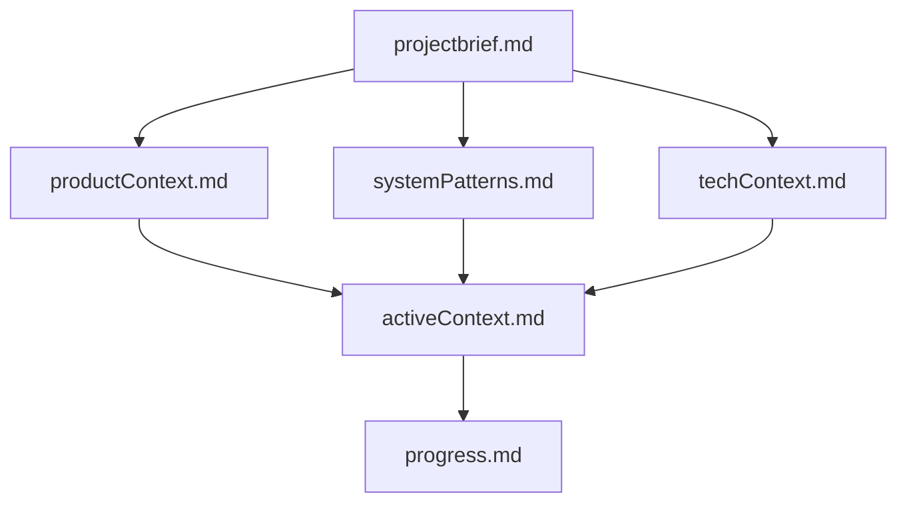

# Memory Bank - LawMint

**Purpose:** This directory contains the complete knowledge base for the LawMint project. After each Cursor session reset, the AI reads these files to understand the project and continue work effectively.

---

## File Structure

### Core Files (Required)

These files build upon each other in a clear hierarchy:



1. **projectbrief.md** (Foundation)
   - Core purpose and requirements
   - Target users and success metrics
   - Timeline and constraints
   - Definition of done
   - **Read first** - Shapes all other files

2. **productContext.md** (The "Why")
   - Why this project exists
   - Problems it solves
   - How it should work
   - User experience goals
   - User personas and flows

3. **systemPatterns.md** (The "How")
   - System architecture
   - Key technical decisions
   - Design patterns in use
   - Component relationships
   - Service boundaries

4. **techContext.md** (The "What")
   - Technologies used
   - Development setup
   - Technical constraints
   - Dependencies
   - Build and deployment

5. **activeContext.md** (The "Now")
   - **Most frequently updated**
   - Current work focus
   - Recent changes
   - Next steps
   - Active decisions and blockers

6. **progress.md** (The "Status")
   - What works
   - What's left to build
   - Current status
   - Known issues
   - Metrics and milestones

---

## How to Use the Memory Bank

### At the Start of Each Session

1. **Read activeContext.md first** - Tells you what you're currently working on
2. **Check progress.md** - Shows what's been completed
3. **Reference specific context files as needed:**
   - Need to understand a user flow? → productContext.md
   - Need to understand architecture? → systemPatterns.md
   - Need to know what tech to use? → techContext.md
   - Need to understand project goals? → projectbrief.md

### When to Update Files

**activeContext.md** (Most frequently):
- ✅ Starting a new phase
- ✅ Completing a major task
- ✅ Encountering a blocker
- ✅ Making a decision
- ✅ End of each work session

**progress.md** (Regularly):
- ✅ Completing a phase
- ✅ Major milestone reached
- ✅ Discovering new issues
- ✅ Updating metrics

**systemPatterns.md** (Occasionally):
- ✅ Discovering new architectural patterns
- ✅ Making significant technical decisions
- ✅ Implementing new design patterns

**techContext.md** (Occasionally):
- ✅ Adding new technologies
- ✅ Changing development setup
- ✅ Updating dependencies

**productContext.md** (Rarely):
- ✅ User flows change
- ✅ New personas identified
- ✅ UX goals evolve

**projectbrief.md** (Very rarely):
- ✅ Core requirements change
- ✅ Timeline shifts significantly
- ⚠️ Only update if fundamental changes occur

---

## Current Project State

**Status:** 🔴 Not Started (Planning Complete)  
**Current Phase:** Phase 0 - Project Setup  
**Progress:** 0%

**All planning and documentation is complete. Ready to begin development.**

---

## Quick Reference

### What's the project about?
→ Read **projectbrief.md** (2-minute read)

### What am I working on right now?
→ Read **activeContext.md** (1-minute read)

### How does the architecture work?
→ Read **systemPatterns.md** (10-minute read)

### What tech stack are we using?
→ Read **techContext.md** (8-minute read)

### What's been completed?
→ Read **progress.md** (5-minute read)

### Why are we building this?
→ Read **productContext.md** (12-minute read)

---

## File Statistics

| File | Lines | Last Updated | Update Frequency |
|------|-------|--------------|------------------|
| projectbrief.md | ~180 | Nov 11, 2025 | Rarely |
| productContext.md | ~380 | Nov 11, 2025 | Rarely |
| systemPatterns.md | ~580 | Nov 11, 2025 | Occasionally |
| techContext.md | ~480 | Nov 11, 2025 | Occasionally |
| activeContext.md | ~420 | Nov 11, 2025 | **Every session** |
| progress.md | ~520 | Nov 11, 2025 | Regularly |

**Total Memory Bank Size:** ~2,560 lines of comprehensive documentation

---

## Related Documentation

**Outside Memory Bank:**
- `/AI-Docs/PRD.md` - Original product requirements document
- `/AI-Docs/TaskList.md` - Detailed task breakdown (1120 lines)
- `/AI-Docs/architecture.md` - Visual architecture diagram with Mermaid

**Hierarchy:**
1. **Memory Bank** - Living knowledge base (this directory)
2. **AI-Docs** - Source documents (reference material)
3. **Code** - Actual implementation (not yet created)

---

## Maintenance Guidelines

### Keep Files Synchronized

When updating one file, check if related files need updates:

**Example:** If you add a new microservice to systemPatterns.md:
- ✅ Update techContext.md (add new dependencies)
- ✅ Update progress.md (add to "What's Left to Build")
- ✅ Update activeContext.md (if currently working on it)

### Avoid Duplication

Don't duplicate information across files. Instead, reference other files:

**Good:**
```markdown
See systemPatterns.md for detailed architecture explanation.
```

**Bad:**
```markdown
[Copies entire architecture section from systemPatterns.md]
```

### Keep It Actionable

Memory Bank files should help the AI (and you) take action:
- Use checklists for tasks
- Include code examples
- Provide clear next steps
- Document decisions with rationale

---

## Version History

**November 11, 2025 - Initial Creation**
- ✅ Created all 6 core memory bank files
- ✅ Documented complete microservices architecture
- ✅ Defined all user flows and personas
- ✅ Established technical stack and patterns
- ✅ Set up 11-phase development roadmap
- ✅ Project ready to begin Phase 0

---

**Last Updated:** November 11, 2025  
**Total Files:** 6 core files + this README  
**Status:** Complete and ready for development

